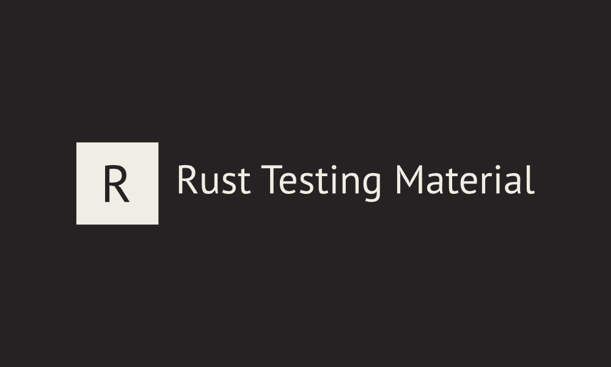

    

This repository contains a curated list of testing material in the Rust ecosystem. Feel free to
[contribute and add your own material](./CONTRIBUTING.md).

> Rust testing material means any resource in a tangible or electronic format that can be used to
> work or learn about testing in the Rust ecosystem. It can be distributed through any type of
> medium such as blogs, talks, repos, books, videos, or audios.
>
> Inspired by [@mre](https://github.com/mre)'s
> [Idiomatic Rust](https://github.com/mre/idiomatic-rust) repository.
